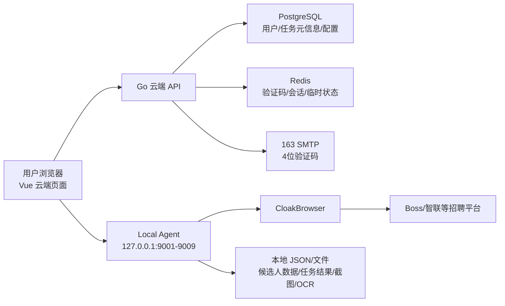
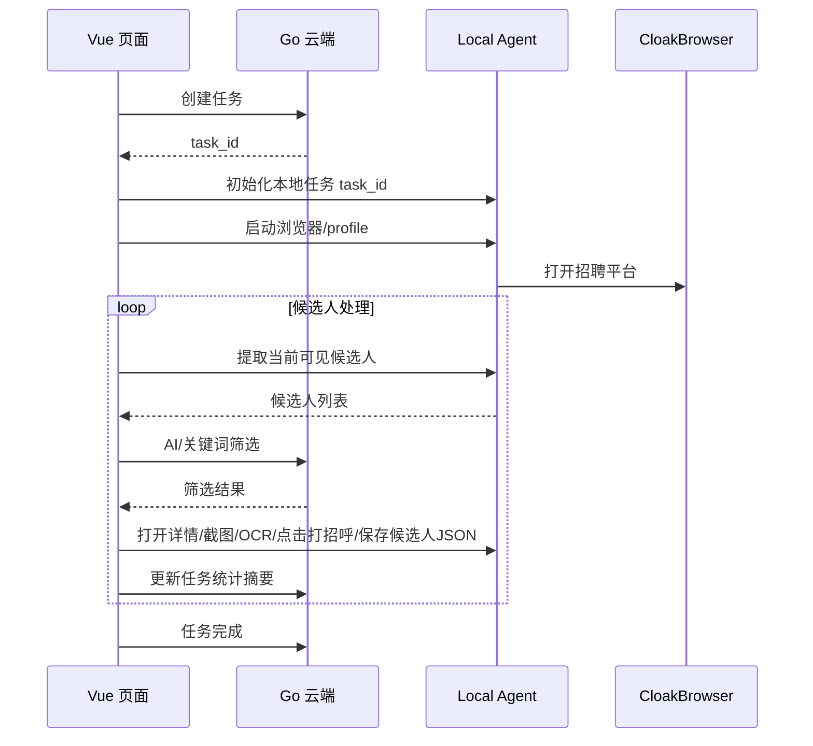

# GoodHR 云端控制台 + 本地执行器架构方案

## 目标

把当前本地 Python 一体化程序拆成：

- 云端 SaaS 控制台：用户登录、任务编排、系统配置、AI 配置、前端页面、版本管理。
- 本地执行器 Local Agent：运行在用户电脑上，负责 CloakBrowser、平台页面操作、cookie/profile、本地候选人数据文件、详情弹框截图和 OCR。

用户以后主要访问云端网页。只有本地执行器升级时才需要下载新版本。

## 技术栈

### 云端

- 后端：Go
- 前端：Vue
- 数据库：PostgreSQL
- 缓存：Redis
- 邮件：163 邮箱 SMTP，发送 4 位数字验证码
- 部署：建议 Docker Compose 起步，后续可拆服务

### 本地

- 本地执行器：可继续用 Python/CloakBrowser 起步，后续可打包成独立桌面程序
- 监听地址：`127.0.0.1`
- 监听端口：从 `9001` 到 `9009` 自动尝试
- 数据：本地 profile + 本地任务候选人 JSON 文件 + 本地截图/OCR 文件

## 总体架构



## 核心原则

1. 云端负责流程，本地负责执行。
2. 用户必须先登录云端。
3. 云端页面登录后尝试连接本地 Agent。
4. 如果本地 Agent 不在线，页面提示下载和启动步骤。
5. 候选人详情、截图和 OCR 结果不存云端，按任务存本地文件。
6. 云端只保存任务元信息、统计摘要、配置和本地机器绑定信息。
7. 本地 Agent 必须和云端账号绑定，后续支持“一个账号只能绑定一台机器”。

## 用户登录

### 登录方式

邮箱 + 4 位数字验证码。

流程：

1. 用户输入邮箱。
2. Go 后端生成 4 位验证码。
3. 验证码存 Redis，设置过期时间，例如 5 分钟。
4. 通过 163 邮箱 SMTP 发送验证码。
5. 用户输入验证码。
6. 验证成功后创建或更新用户。
7. 返回登录态。

### 推荐登录态

初期推荐：

- Access Token：短有效期，例如 2 小时。
- Refresh Token：长有效期，例如 30 天。
- Refresh Token 可放 HttpOnly Cookie。

### Redis Key 示例

```text
login_code:{email} -> 4位验证码，TTL 5分钟
login_code_limit:{email} -> 发送频率限制
session:{refresh_token_id} -> 用户会话
```

### 发送验证码限制

建议限制：

- 同一邮箱 60 秒只能发一次。
- 同一邮箱每天最多若干次。
- 同一 IP 每分钟最多若干次。

## 云端数据边界

### 云端保存

- 用户信息。
- 系统默认 AI 配置。
- 用户自己的 AI 配置。
- 平台账号显示名和本地 profile 映射 ID。
- 本地 Agent 机器码。
- 任务元信息。
- 任务统计摘要。
- 任务运行日志摘要。
- 本地 Agent 版本信息。

### 云端不保存

- 候选人详情正文。
- 候选人简历原文。
- 候选人详情截图。
- OCR 原始识别文本。
- 招聘平台 cookie。
- 本地浏览器 profile。

候选人数据、截图和 OCR 结果由本地 Agent 写入任务目录。云端网页通过 Local Agent API 读取、搜索、删除、预览和导出。

## AI 配置策略

系统支持两层 AI 配置：

1. 系统默认配置。
2. 用户自定义配置。

任务运行时优先级：

```text
用户 AI 配置 > 系统默认 AI 配置
```

如果用户没有配置 API Key、模型或 base_url，则使用系统默认值。

### 云端表建议

```text
system_ai_config
- id
- base_url
- model
- api_key_encrypted
- temperature
- prompt_template
- enabled
- updated_at

user_ai_config
- id
- user_id
- base_url
- model
- api_key_encrypted
- temperature
- prompt_template
- enabled
- updated_at
```

API Key 必须加密存储。

## 本地 Agent 连接流程

用户登录云端后，Vue 页面开始探测：

```text
http://127.0.0.1:9001/health
http://127.0.0.1:9002/health
...
http://127.0.0.1:9009/health
```

第一个成功响应的端口作为本地 Agent 地址。

如果全部失败：

- 页面显示“未检测到本地程序”。
- 提供本地程序下载按钮。
- 展示启动步骤。
- 提示启动后点击“重新检测”。

## 本地 Agent 初始化与绑定

连接成功后需要完成初始化。

### 本地 Agent 生成机器码

机器码用于后续限制一个云端账号只能绑定一台机器。

建议机器码来源：

- OS 类型。
- 主机名。
- 用户目录路径哈希。
- 网卡 MAC 哈希。
- 本地随机安装 ID。

不要把原始硬件信息直接上传云端，只上传哈希后的 machine_id。

本地保存：

```text
agent_data/machine.json
```

示例：

```json
{
  "machine_id": "sha256-xxxx",
  "install_id": "uuid",
  "created_at": "2026-05-18T00:00:00Z"
}
```

### 云端绑定

页面拿到本地 Agent 的 `machine_id` 后，调用云端：

```http
POST /api/agents/bind
```

请求：

```json
{
  "machine_id": "sha256-xxxx",
  "agent_version": "0.1.0",
  "local_port": 9001
}
```

云端保存：

```text
local_agents
- id
- user_id
- machine_id
- agent_version
- last_seen_at
- bind_status
- created_at
```

### 本地保存当前云端账号

绑定成功后，云端页面调用本地 Agent：

```http
POST /api/v1/session/bind-cloud-user
```

请求：

```json
{
  "cloud_user_id": "user_xxx",
  "cloud_email": "user@example.com",
  "agent_token": "local-token"
}
```

本地保存：

```text
agent_data/cloud_account.json
```

示例：

```json
{
  "cloud_user_id": "user_xxx",
  "cloud_email": "user@example.com",
  "bound_at": "2026-05-18T00:00:00Z"
}
```

## 账号机器绑定策略

目标：后续可能限制一个账号只能在一台机器使用。

推荐策略：

- 初期只记录，不强限制。
- 后台提供开关：
  - 不限制。
  - 一个账号只能绑定一台机器。
  - 一个账号最多绑定 N 台机器。
- 如果用户换电脑，需要后台解绑或用户自助解绑。

判断逻辑：

1. 用户登录云端。
2. 页面连接本地 Agent。
3. 云端收到 machine_id。
4. 如果该 user_id 已绑定其他 machine_id 且策略不允许，则拒绝初始化本地 Agent。

## 本地候选人数据存储

候选人数据不存云端。

每个任务一个 JSON 文件。

目录建议：

```text
agent_data/tasks/{cloud_task_id}/candidates.json
agent_data/tasks/{cloud_task_id}/logs.jsonl
agent_data/tasks/{cloud_task_id}/screenshots/
agent_data/tasks/{cloud_task_id}/ocr/
```

### candidates.json 示例

```json
{
  "task_id": "task_abc",
  "cloud_user_id": "user_xxx",
  "platform_id": "boss",
  "platform_account_id": "boss_main",
  "position_id": "pos_123",
  "created_at": "2026-05-18T00:00:00Z",
  "items": [
    {
      "id": "candidate_001",
      "name": "张女士",
      "age": "24岁",
      "education": "本科",
      "experience": "3年",
      "salary": "",
      "skills": "直播 设计 画画",
      "status": "greeted",
      "filter_reason": "关键词匹配：本科",
      "raw_data": "打开候选详情弹框时看到的所有信息",
      "ocr_text": "详情弹框截图 OCR 后的文本，本地保存",
      "screenshots": [
        "screenshots/candidate_001_20260518_000000.png"
      ],
      "platform_user_id": "",
      "created_at": "2026-05-18T00:00:00Z"
    }
  ]
}
```

### 截图与 OCR

本地 Agent 必须保留当前已经验证可用的截图和 OCR 能力。迁移时优先复用现有代码，不重新设计截图算法：

- `goodhrpy/core/platform/base.py`
  - `screenshot_detail(page)`：候选人详情弹框截图入口。
  - `_scroll_and_stitch(...)`：详情内容超过可视区域时滚动截图并拼接。
  - `_stitch_screenshots(...)`：多张 PNG 拼接。
  - `_fallback_screenshot(page)`：详情容器定位失败时退回整页截图。
- `goodhrpy/core/task.py`
  - 现有截图保存逻辑：`_save_screenshot(...)`。
  - 现有 OCR 调用逻辑：详情模式为 `ocr` 且详情弹框打开后，截图并调用 OCR。
- `goodhrpy/utils/ocr.py`
  - PaddleOCR 懒加载。
  - `ocr_image_async(image_bytes)` 异步封装。
  - `close_ocr()` 释放模型资源。

第一版 Local Agent 的截图/OCR 边界：

- 截图文件只保存在本地任务目录 `screenshots/`。
- OCR 文本只保存在本地任务目录 `ocr/` 和当前任务的 `candidates.json`。
- 云端只保存是否存在截图、OCR 状态、数量等摘要，不保存图片和 OCR 原文。
- Vue 页面需要预览截图或查看 OCR 文本时，直接请求 Local Agent。
- PaddleOCR 依赖、模型缓存和运行资源全部留在本地 Agent 内，不放到云端。

### 云端任务只保存摘要

云端 `task_runs` 保存：

```text
- task_id
- user_id
- platform_id
- platform_account_id
- position_id
- mode
- match_limit
- status
- scanned_count
- greeted_count
- skipped_count
- failed_count
- local_data_path 或 local_task_id
- created_at
- started_at
- finished_at
```

候选人列表页面读取本地：

```http
GET http://127.0.0.1:9001/api/v1/tasks/{task_id}/candidates
```

云端页面拿到数据后在浏览器中渲染。

## 本地 Agent API 草案

### 健康检查

```http
GET /health
```

返回：

```json
{
  "ok": true,
  "name": "GoodHR Local Agent",
  "version": "0.1.0",
  "port": 9001,
  "machine_id": "sha256-xxxx",
  "bound_cloud_user_id": "user_xxx"
}
```

### 初始化

```http
POST /api/v1/session/init
```

请求：

```json
{
  "cloud_user_id": "user_xxx",
  "cloud_email": "user@example.com",
  "cloud_token_hint": "optional"
}
```

返回：

```json
{
  "ok": true,
  "machine_id": "sha256-xxxx",
  "agent_version": "0.1.0"
}
```

### 本地 profile 管理

```http
GET /api/v1/profiles
POST /api/v1/profiles
DELETE /api/v1/profiles/{profile_id}
```

### 浏览器控制

```http
POST /api/v1/browser/start
POST /api/v1/browser/stop
POST /api/v1/browser/goto
```

### 页面操作

```http
POST /api/v1/page/extract-visible-candidates
POST /api/v1/page/open-detail
POST /api/v1/page/close-detail
POST /api/v1/page/click
POST /api/v1/page/scroll
POST /api/v1/page/screenshot
```

### 详情截图与 OCR

```http
POST /api/v1/tasks/{task_id}/screenshot-detail
POST /api/v1/tasks/{task_id}/ocr-detail
GET /api/v1/tasks/{task_id}/screenshots
GET /api/v1/tasks/{task_id}/screenshots/{filename}
DELETE /api/v1/tasks/{task_id}/screenshots
```

说明：

- `screenshot-detail` 使用当前已打开的候选人详情弹框截图，返回截图文件元信息。
- `ocr-detail` 对当前详情截图执行 OCR，写入当前候选人的 `ocr_text`，并返回识别文本摘要。
- `screenshots/{filename}` 只允许读取当前任务目录内的文件，禁止任意路径读取。

### 本地候选人数据

```http
GET /api/v1/tasks/{task_id}/candidates
POST /api/v1/tasks/{task_id}/candidates
PUT /api/v1/tasks/{task_id}/candidates/{candidate_id}
DELETE /api/v1/tasks/{task_id}/candidates/{candidate_id}
GET /api/v1/tasks/{task_id}/logs
```

## 云端 API 草案

### 登录

```http
POST /api/auth/send-code
POST /api/auth/login
POST /api/auth/refresh
POST /api/auth/logout
```

### Agent

```http
POST /api/agents/bind
GET /api/agents/current
POST /api/agents/heartbeat
```

### 配置

```http
GET /api/config/system-ai
PUT /api/admin/config/system-ai
GET /api/config/user-ai
PUT /api/config/user-ai
GET /api/config/task-defaults
PUT /api/config/task-defaults
```

### 任务

```http
POST /api/tasks
GET /api/tasks
GET /api/tasks/{task_id}
POST /api/tasks/{task_id}/start
POST /api/tasks/{task_id}/stop
POST /api/tasks/{task_id}/log
```

任务具体执行步骤由 Vue 页面协调云端任务状态和 Local Agent。

## 直连 localhost 的浏览器限制

云端网页访问本地 Agent 属于跨源访问。

本地 Agent 必须响应 CORS：

```http
Access-Control-Allow-Origin: https://your-goodhr-domain.com
Access-Control-Allow-Methods: GET, POST, PUT, DELETE, OPTIONS
Access-Control-Allow-Headers: Content-Type, Authorization, X-GoodHR-Local-Token
Access-Control-Allow-Private-Network: true
```

并处理 OPTIONS 预检。

参考：

- Chrome Private Network Access: https://developer.chrome.com/blog/private-network-access-preflight
- MDN CORS: https://developer.mozilla.org/en-US/docs/Web/HTTP/Guides/CORS

## 本地 Agent 安全

必须做到：

- 只监听 `127.0.0.1`。
- 不监听 `0.0.0.0`。
- 只允许云端正式域名 Origin。
- 本地生成 token，云端页面初始化后携带 token 调用。
- 不提供任意文件读写接口。
- 不提供任意 shell 执行接口。
- 所有操作都限制在 GoodHR 数据目录和浏览器控制能力内。

## 前端启动体验

用户登录云端后：

1. Vue 页面显示“正在检测本地程序”。
2. 依次探测 9001-9009。
3. 如果连接成功：
   - 显示本地 Agent 版本。
   - 显示当前机器绑定状态。
   - 同步本地 profiles。
   - 允许创建任务。
4. 如果连接失败：
   - 显示下载本地程序按钮。
   - 显示启动步骤。
   - 显示“重新检测”按钮。

## 任务执行流程



## PostgreSQL 表建议

```text
users
- id
- email
- created_at
- last_login_at

local_agents
- id
- user_id
- machine_id
- agent_version
- last_seen_at
- bind_status
- created_at

platform_accounts
- id
- user_id
- platform_id
- display_name
- local_profile_id
- local_agent_id
- created_at

positions
- id
- user_id
- name
- keywords
- exclude_keywords
- description
- greet_message
- is_and_mode
- created_at

task_runs
- id
- user_id
- local_agent_id
- platform_id
- platform_account_id
- position_id
- mode
- match_limit
- status
- scanned_count
- greeted_count
- skipped_count
- failed_count
- local_task_id
- created_at
- started_at
- finished_at

task_logs
- id
- task_id
- user_id
- level
- message
- created_at

system_ai_config
- id
- base_url
- model
- api_key_encrypted
- temperature
- prompt_template
- enabled
- updated_at

user_ai_config
- id
- user_id
- base_url
- model
- api_key_encrypted
- temperature
- prompt_template
- enabled
- updated_at
```

## Redis 用途

```text
login_code:{email}
login_code_limit:{email}
session:{session_id}
agent_online:{user_id}:{machine_id}
task_runtime:{task_id}
```

## 迁移步骤

### 第 1 阶段：云端骨架

- Go 后端项目初始化。
- Vue 前端项目初始化。
- PostgreSQL schema。
- Redis。
- 邮箱验证码登录。
- 用户 AI 配置和系统 AI 配置。

### 第 2 阶段：本地 Agent

- 拆出本地执行器。
- 监听 9001-9009。
- 实现 `/health`。
- 实现 CORS/PNA。
- 实现 machine_id。
- 实现云端账号绑定。
- 实现 profile 管理。
- 迁移现有详情弹框截图能力，复用 `BasePlatform.screenshot_detail()`、滚动拼接和 fallback 截图逻辑。
- 迁移现有 OCR 能力，复用 `utils/ocr.py` 的 PaddleOCR 懒加载和异步识别封装。

### 第 3 阶段：云端页面连接本地

- Vue 页面登录后自动探测本地 Agent。
- 未连接时显示下载和启动步骤。
- 连接后显示本地状态和版本。

### 第 4 阶段：任务协议化

- 云端创建任务。
- 本地创建任务 JSON。
- Vue 协调云端任务状态和本地执行接口。
- 候选人数据按任务写入本地 JSON。
- 详情截图按任务写入本地 `screenshots/`。
- OCR 文本按任务写入本地 `ocr/`，并同步摘要到候选人 JSON。
- 云端只保存统计摘要。

### 第 5 阶段：升级与限制

- 本地 Agent 版本检查。
- 云端下载链接管理。
- 机器绑定策略。
- 一个账号一台机器限制开关。

## 需要确认的问题

1. 163 邮箱是普通 SMTP 授权码，还是企业邮箱 SMTP？
2. 云端是否需要管理员后台，用来配置系统默认 AI、查看用户、解绑机器？
3. 本地 Agent 首版只支持 macOS，还是 Windows/macOS 都要？
4. 候选人 JSON 是否需要加密存储？
5. 用户关闭云端网页后，任务是否允许继续跑？如果要继续跑，需要第二阶段做 WebSocket 或本地任务守护。

## 推荐第一版范围

第一版建议只做：

- Go + Vue + PostgreSQL + Redis 云端基础。
- 邮箱验证码登录。
- 本地 Agent 直连。
- 本地机器绑定记录。
- 用户 AI 配置覆盖系统 AI 配置。
- 任务创建和运行。
- 候选人数据本地 JSON。
- 详情弹框截图和 OCR 本地保存，本地 Agent 提供预览与读取接口。
- 云端候选人页面通过 Local Agent 读取 JSON 渲染。

暂不做：

- 云端保存候选人详情。
- 多机器同时在线。
- WebSocket Agent。
- 复杂管理员权限。
