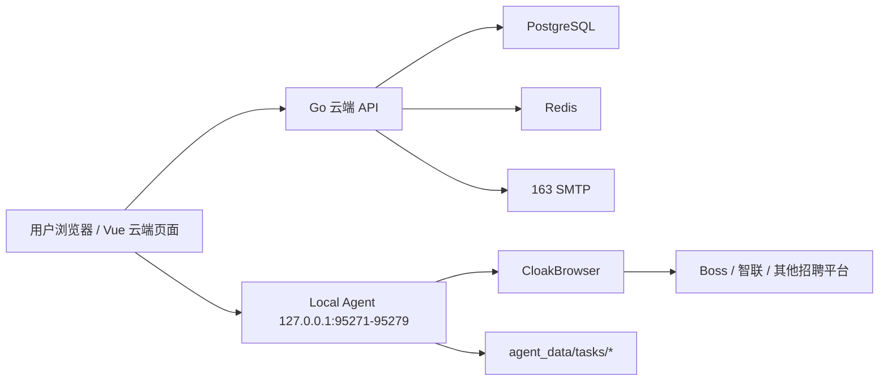

# GoodHR 5 架构摘要

## 组件

## 数据边界

云端保存：

- 用户邮箱和登录会话。
- 系统默认配置和用户配置。
- 平台账号的显示名和本地 profile 映射。
- 机器码和 Agent 版本。
- 任务元信息、统计摘要和日志摘要。

本地保存：

- 招聘平台 cookie/profile。
- 候选人详情数据。
- 候选人详情截图。
- OCR 原始文本。
- 每个任务的 `candidates.json`。

## 任务运行态归属

- 网页是任务控制台，不是任务执行器。
- Local Agent 才是任务执行器，任务运行中的真实状态必须归属 Local Agent。
- 云端保存任务元信息、统计摘要、控制指令结果和日志摘要，不保存浏览器内的临时执行上下文。
- 浏览器刷新、关闭页面、重新登录后，网页应该重新连接云端和 Local Agent，恢复展示当前任务状态，而不是让任务随页面内存一起消失。
- 后续所有任务启动、暂停、继续、停止设计，都必须遵守这个边界。

## 本地 Agent 关键职责

- 只监听 `127.0.0.1`。
- 自动尝试 `95271-95279` 端口。
- 提供健康检查、初始化、profile 管理、浏览器控制、页面操作、任务数据管理接口。
- 保留现有已验证可用的截图和 OCR 实现，迁移时优先复用当前代码。
- 所有文件读写限制在 `agent_data` 内。
