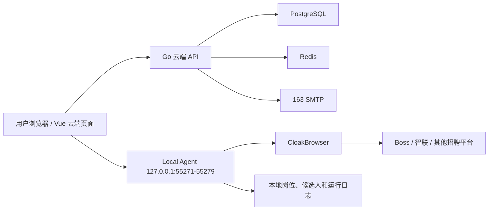

# GoodHR 5 架构摘要

## 组件

```mermaid
flowchart LR
  Browser["用户浏览器 / Vue 云端页面"] --> Cloud["Go 云端 API"]
  Cloud --> PG["PostgreSQL"]
  Cloud --> Redis["Redis"]
  Cloud --> SMTP["163 SMTP"]
  Browser --> Agent["Local Agent 127.0.0.1:55271-55279"]
  Agent --> Cloak["CloakBrowser"]
  Cloak --> Platform["Boss / 智联 / 其他招聘平台"]
  Agent --> LocalFiles["本地岗位、候选人和运行日志"]
```

## 数据边界

云端保存：

- 用户邮箱和登录会话。
- 系统默认配置和用户配置。
- 平台账号的显示名和本地 profile 映射。
- 机器码和 Agent 版本。
- 岗位配置、累计统计和日志摘要。

本地保存：

- 招聘平台 cookie/profile。
- 候选人详情数据。
- 候选人详情截图。
- OCR 原始文本。
- 按岗位关联的候选人数据。

## 岗位运行态归属

- 网页是岗位控制台，不是岗位运行执行器。
- Local Agent 才是岗位运行执行器，运行中的真实状态必须归属 Local Agent。
- 云端保存岗位配置、累计统计、控制指令结果和日志摘要，不保存浏览器内的临时执行上下文。
- 浏览器刷新、关闭页面、重新登录后，网页应该重新连接云端和 Local Agent，恢复展示当前岗位状态，而不是让岗位运行随页面内存一起消失。
- 后续所有岗位启动、暂停、继续、停止设计，都必须遵守这个边界。

## 本地 Agent 关键职责

- 只监听 `127.0.0.1`。
- 自动尝试 `55271-55279` 端口。
- 提供健康检查、初始化、profile 管理、浏览器控制、页面操作、岗位运行数据管理接口。
- 保留现有已验证可用的截图和 OCR 实现，迁移时优先复用当前代码。
- 所有文件读写限制在 `agent_data` 内。
