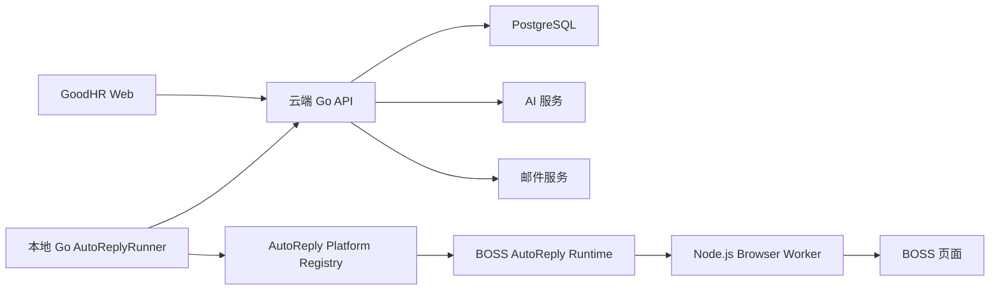

<!-- 本文件用于定义 GoodHR 自动回复功能的系统架构、模块边界、数据模型、接口协议和实施方案。 -->

# GoodHR 自动回复技术方案

## 1. 方案目标

在不破坏现有岗位运行的前提下，新增与 `positionrunner` 同级的自动回复主流程，并优先实现 BOSS 直聘。系统必须支持后续平台扩展，避免把 BOSS 选择器、AI 提示词、云端数据和运行循环混在同一个模块中。

本方案采用三段式边界：

- 云端 Go：业务大脑，负责数据、AI 编排、条件状态、回复决策、面试推荐和邮件。
- 本地 Go：流程调度器，负责账号锁、循环、重试、云端通信和调用平台能力。
- Node.js Worker：浏览器执行器，只负责读取页面和执行点击、滚动、输入、发送等具体动作。

## 2. 与现有架构的关系

当前代码已经有：

- 云端 `candidate_profiles`、`candidate_engagements`、`candidate_events`。
- 云端岗位归属、AI 兼容接口、AI 钱包和邮件发送能力。
- 本地 `positionrunner` 岗位运行器。
- 本地 `internal/platforms/boss` 等平台 runtime。
- Node.js Worker 的通用页面动作接口。

现有 `architecture.md` 和 `development-standards.md` 仍写着候选人详情只保存在本地。本功能已明确要求简历、评分和完整消息进入云端，因此实施本功能时必须同步修改这两份架构规范，形成新的数据边界决策，不能让代码和文档长期冲突。

## 3. 总体架构



数据流分为两个方向：

1. 页面上行：BOSS 页面 → Node Worker → 本地 Go → 云端消息同步与 AI 决策。
2. 动作下行：云端结构化回复计划 → 本地 Go 校验 → BOSS runtime → Node Worker → BOSS 页面。

## 4. 模块目录建议

### 4.1 云端后端

```text
cloud/backend/internal/httpapi/
├── auto_reply.go                 # 自动回复配置、线程和控制 API
├── auto_reply_service.go         # 自动回复业务编排入口
├── auto_reply_store.go           # 自动回复数据仓库接口
├── auto_reply_store_pg.go        # PostgreSQL 实现
├── auto_reply_ai.go              # AI 请求、结构化输出和安全校验
├── auto_reply_prompt.go          # 四层提示词组装与版本记录
├── auto_reply_conditions.go      # 条件证据、状态合并和资格版本
├── auto_reply_summary.go         # 面试推荐生成
├── auto_reply_notification.go    # 达标和异常邮件
└── auto_reply_*_test.go          # 各模块测试
```

如果后续继续膨胀，再从 `httpapi` 抽成 `internal/autoreply` 包；第一版可以保持现有项目组织方式，但禁止堆入 `server.go`、`position.go` 或 `candidate.go` 大文件。

### 4.2 本地 Go

```text
local-agent-go/internal/
├── autoreplyrunner/
│   ├── runner.go                 # 启动、停止、循环和账号锁
│   ├── lifecycle.go              # 状态机和轮询生命周期
│   ├── sync.go                   # 历史消息同步流程
│   ├── decision.go               # 调云端获取回复计划
│   ├── send.go                   # 发送前复核、发送和回读确认
│   ├── error_policy.go           # 重试、阻塞、熔断和通知策略
│   └── *_test.go
└── platforms/
    ├── auto_reply.go             # 跨平台自动回复接口
    └── boss/
        ├── auto_reply.go         # BOSS 自动回复能力组合
        ├── messages.go           # 未读列表与对话历史
        ├── message_parser.go     # 文本和卡片标准化
        └── reply.go              # 输入、发送和回读确认
```

### 4.3 Node.js Worker

```text
local-agent-go/worker-node/src/
├── auto-reply-actions.js         # 自动回复通用浏览器原子动作
├── auto-reply-actions.test.js
└── platform-actions/
    └── boss-auto-reply.js        # BOSS 页面结构相关动作
```

Node.js 方法只返回页面事实，不做“是否符合”“该怎么回答”等业务判断。

## 5. 核心接口抽象

本地 Go 定义独立的自动回复平台能力，不能直接复用或污染打招呼 runtime 的大接口：

```go
// AutoReplyPlatform 定义招聘平台自动回复流程需要的页面能力。
type AutoReplyPlatform interface {
    OpenMessageCenter(ctx context.Context, exec Executor, account Account) error
    ReadUnreadThreads(ctx context.Context, exec Executor) ([]UnreadThread, error)
    OpenThread(ctx context.Context, exec Executor, thread UnreadThread) (ThreadIdentity, error)
    ReadHistory(ctx context.Context, exec Executor, identity ThreadIdentity) (HistorySnapshot, error)
    ReadLatestState(ctx context.Context, exec Executor, identity ThreadIdentity) (LatestState, error)
    SendReply(ctx context.Context, exec Executor, identity ThreadIdentity, text string) (SendResult, error)
}
```

调用方只依赖统一结构：

```go
// StandardMessage 表示跨平台统一消息结构。
type StandardMessage struct {
    PlatformMessageID string
    Fingerprint       string
    Direction         string
    MessageType       string
    Text              string
    Card              map[string]any
    SenderName        string
    SentAt            time.Time
    Raw               map[string]any
}
```

第一版 BOSS 实现该接口；未来其他平台只增加 runtime 和 Worker 页面动作，不修改云端 AI 主流程。

## 6. 本地自动回复主流程

### 6.1 与岗位运行同级

在 `app.Server` 中分别注入：

- `positionrunner.Runner`：自动筛选和打招呼。
- `autoreplyrunner.Runner`：消息检查和自动回复。

二者共享浏览器 Worker、平台账号和日志设施，但各自拥有状态和 API。自动回复不能作为 `positionrunner.Run()` 中的一段巨大分支。

### 6.2 账号互斥

同一平台账号同一时刻只能有一个会改变浏览器页面的流程。建议锁键：

```text
platform_id + platform_account_id
```

第一版调度策略：

- 自动回复有未读消息时优先获得锁。
- 打招呼完成当前不可中断原子步骤后释放锁。
- 自动回复处理完本轮未读快照后释放锁，避免长期饿死打招呼。
- 停止命令设置停止标记，当前发送/回读原子步骤完成后退出。

### 6.3 单轮伪代码

```text
RunRound(position, account):
  获取账号操作锁
  打开 BOSS 消息中心
  unread = 读取本轮未读线程快照
  for thread in unread:
    如果岗位已停止则退出
    重新定位并打开 thread
    identity = 校验候选人身份
    history = 加载并解析完整历史
    syncResult = 云端幂等同步消息
    如果没有新候选人消息则继续
    plan = 云端生成结构化回复计划
    如果 plan.action == notify_only:
      云端记录阻塞并投递异常邮件
      continue
    latest = 发送前重新读取最新状态
    如果 latest 与 plan.based_on_message 不一致:
      重新同步并重新决策，不能发送旧 plan
    清空输入框并输入 plan.reply_text
    点击发送
    回读确认己方最后消息
    云端确认发送结果
  释放账号操作锁
```

## 7. BOSS 页面执行设计

### 7.1 原子动作

建议 Worker 提供 BOSS 专用接口：

| 路径 | 作用 |
| --- | --- |
| `POST /api/v1/boss/auto-reply/open-center` | 打开或聚焦消息中心 |
| `POST /api/v1/boss/auto-reply/unread-threads` | 返回未读线程快照 |
| `POST /api/v1/boss/auto-reply/open-thread` | 用稳定身份定位并打开候选人 |
| `POST /api/v1/boss/auto-reply/history` | 向上加载并解析对话历史 |
| `POST /api/v1/boss/auto-reply/latest-state` | 发送前读取最新消息和输入框状态 |
| `POST /api/v1/boss/auto-reply/send` | 清空、输入、点击发送并返回初步结果 |
| `POST /api/v1/boss/auto-reply/confirm-sent` | 回读最后一条己方消息确认成功 |

每个接口只做一个稳定页面动作，返回结构化数据、当前 URL、候选人身份和关键定位证据。

### 7.2 候选人列表快照

`unread-threads` 返回：

```json
{
  "threads": [
    {
      "platform_thread_id": "可读取的平台线程ID",
      "platform_candidate_id": "可读取的平台候选人ID",
      "candidate_name": "张三",
      "last_message_preview": "可以异地",
      "last_message_time": "2026-07-20T10:10:00+08:00",
      "unread_count": 2,
      "locator_hint": "页面可复核的稳定定位信息"
    }
  ]
}
```

没有稳定 ID 时生成临时键，但打开线程后必须通过聊天区域身份再次校验，禁止仅凭姓名发送。

### 7.3 历史加载

向上滚动必须模拟真实用户操作，不使用 JS 注入推动页面滚动。停止条件满足任一即可：

- 出现明确的历史起点。
- 连续两次滚动没有新增消息。
- 达到配置的最大滚动次数或最大历史条数。

返回 `history_complete`，让云端知道历史是否完整。历史不完整不一定阻塞回复，但 AI 不得声称掌握所有旧对话。

### 7.4 消息解析

每条 DOM 消息转换为：

- 方向：candidate/self/system。
- 类型：text/job_card/resume_card/action_card/image/voice/file/emoji/system/unknown。
- 正文或页面可见摘要。
- 时间、发送人、平台 ID。
- 卡片字段和原始可见属性。
- DOM 顺序和会话身份。

卡片解析器按类型独立，不要在一个巨大 `if/else` 中维护所有卡片。

### 7.5 发送与确认

发送分两步：

1. `send`：聚焦输入框、全选清空、逐字输入、核对输入值、点击发送。
2. `confirm-sent`：等待页面新增己方消息，核对文本、候选人身份和发送时间。

若点击超时但页面已出现匹配消息，应判定成功；若点击返回成功但页面没出现消息，应判定未知并先回读，禁止直接重发。

## 8. 云端 API

### 8.1 配置与控制

| 方法 | 路径 | 作用 |
| --- | --- | --- |
| `GET` | `/api/positions/{id}/auto-reply-config` | 读取配置 |
| `PUT` | `/api/positions/{id}/auto-reply-config` | 保存知识库、条件和提示词 |
| `POST` | `/api/positions/{id}/auto-reply/start` | 下发启动意图 |
| `POST` | `/api/positions/{id}/auto-reply/stop` | 下发停止意图 |
| `GET` | `/api/positions/{id}/auto-reply/status` | 查询云端汇总状态 |

### 8.2 本地 Agent 调用

| 方法 | 路径 | 作用 |
| --- | --- | --- |
| `POST` | `/api/auto-reply/threads/resolve` | 解析候选人、岗位和触达关系 |
| `POST` | `/api/auto-reply/messages/sync` | 幂等同步历史消息 |
| `POST` | `/api/auto-reply/decisions` | 针对最新消息生成回复计划 |
| `POST` | `/api/auto-reply/decisions/{id}/sent` | 上报实际发送与回读证据 |
| `POST` | `/api/auto-reply/decisions/{id}/failed` | 上报页面执行失败 |
| `POST` | `/api/auto-reply/threads/{id}/heartbeat` | 更新运行和检查状态 |

所有 Agent API 必须验证机器绑定、用户、租户、岗位和平台账号归属，不接受仅凭 ID 的跨租户请求。

## 9. 数据模型

### 9.1 复用现有表

- `candidate_profiles`：继续保存简历、原文和两次 AI 分数。
- `candidate_engagements`：表示候选人、岗位、平台账号的触达关系。
- `candidate_events`：保留高层业务事件和兼容历史数据，不把完整聊天强塞进单一事件表。
- `positions.user_id`：用于确定岗位创建人和通知邮箱。

### 9.2 新增表建议

#### `position_auto_reply_configs`

保存岗位自动回复开关和版本化配置：

- `position_id`：岗位 ID，唯一。
- `enabled`：是否启用。
- `poll_interval_seconds`：检查间隔。
- `max_threads_per_round`：单轮最大线程数。
- `knowledge_base`：企业、岗位和 FAQ 的 JSONB。
- `enterprise_prompt`：企业规则。
- `position_prompt`：岗位规则。
- `user_reply_prompt`：用户可编辑回复提示词。
- `fallback_reply`：资料不足时允许使用的话术。
- `unmatched_reply`：通用礼貌结束语。
- `retry_policy`：重试和重问配置 JSONB。
- `version`：配置版本。
- `created_at/updated_at`。

#### `position_reply_conditions`

- `id/position_id`。
- `name/description`。
- `priority`。
- `question_template`。
- `pass_rule/fail_rule`。
- `unmatched_reply`。
- `requires_chat_confirmation`：是否必须聊天明确确认。
- `enabled`。
- `created_at/updated_at`。

#### `candidate_conversations`

- `id/tenant_id/engagement_id`。
- `platform_thread_id`。
- `status`。
- `last_synced_message_fingerprint`。
- `last_candidate_message_id`。
- `last_decision_id`。
- `qualification_version`。
- `history_complete`。
- `blocked_reason`。
- `last_checked_at/updated_at`。

#### `candidate_messages`

- `id/tenant_id/conversation_id`。
- `platform_message_id`。
- `fingerprint`。
- `direction/message_type`。
- `text_content/card_content/raw_content`。
- `sender_name/platform_sent_at`。
- `ingested_at`。
- 唯一键优先使用 `(conversation_id, platform_message_id)`；没有平台 ID 时使用 `(conversation_id, fingerprint)`。

#### `candidate_condition_results`

- `conversation_id/condition_id` 唯一。
- `status`：unknown/matched/unmatched/conflicted。
- `evidence_message_id`。
- `evidence_source`：chat/resume。
- `evidence_text`。
- `confidence`。
- `last_confirmed_at/updated_at`。

#### `auto_reply_decisions`

- `id/conversation_id`。
- `based_on_message_id`。
- `action`：reply/end_unmatched/notify_only/noop。
- `intent_result/condition_changes/retrieved_knowledge` JSONB。
- `reply_text`。
- `prompt_version/model/token_usage`。
- `status`：planned/sending/sent/failed/obsolete。
- `idempotency_key` 唯一。
- `sent_at/created_at`。

#### `candidate_interview_recommendations`

- `id/conversation_id/qualification_version` 唯一。
- `summary/match_points/risks/condition_snapshot/suggested_questions`。
- `model/token_usage`。
- `created_at`。

#### `candidate_notification_deliveries`

- `id/conversation_id/recommendation_id`。
- `notification_type`：qualified/blocked。
- `recipient_user_id/recipient_email`。
- `idempotency_key` 唯一。
- `status/error_message/sent_at/created_at`。

所有新增 SQL 表和字段必须添加中文 `COMMENT`。

## 10. 消息幂等与身份关联

### 10.1 候选人关联

优先顺序：

1. 租户 + 平台 + 平台候选人 ID。
2. 已存在 engagement 的平台线程 ID。
3. BOSS 对话可见链接或稳定数据属性。
4. 姓名 + 岗位 + 平台账号 + 最近消息仅作为候选集，不足以直接确认发送身份。

身份不唯一时必须 `notify_only`，不能猜一个候选人发送。

### 10.2 消息指纹

平台无消息 ID 时建议：

```text
SHA256(conversation_identity + direction + message_type + normalized_content + visible_time + dom_order_bucket)
```

不能只用正文去重，因为候选人可能连续发送两次“好的”。首次全量同步在单次快照内用 DOM 顺序辅助；跨快照再结合前后消息窗口比对。

### 10.3 决策幂等

```text
decision idempotency key = conversation_id + based_on_message_id + config_version
```

同一消息、同一配置版本只能有一个有效决策。配置改变后允许重新决策，但已成功发送的历史决策不能再次发送。

## 11. 云端 AI 编排

### 11.1 分步而非一个超级提示词

建议拆成三个可独立修改和测试的阶段：

1. 理解阶段：识别意图、候选人问题、条件证据和冲突。
2. 决策阶段：应用确定性业务规则，决定继续、礼貌结束、无法处理或达标。
3. 表达阶段：根据已批准事实和动作生成最终回复。

条件状态合并、是否全部满足、资格版本和邮件幂等必须由代码完成，不能交给 AI 自由判断。

### 11.2 输入上下文

- 系统安全规则。
- 企业、岗位和用户提示词。
- 知识库检索结果，不把无关知识全部塞入。
- 简历结构化字段、原文摘要和两次评分。
- 完整消息或长对话压缩摘要 + 最近原文窗口。
- 当前条件和证据。
- 最新一条或一组未处理候选人消息。

### 11.3 结构化输出

```json
{
  "intents": ["ask_salary", "answer_condition"],
  "candidate_questions": ["薪资结构是什么"],
  "condition_updates": [
    {
      "condition_id": "uuid",
      "status": "matched",
      "evidence_message_id": "uuid",
      "reason": "候选人最新回复明确接受异地工作"
    }
  ],
  "knowledge_refs": ["faq:salary_structure"],
  "action": "reply",
  "next_condition_id": "uuid",
  "reply_text": "……",
  "cannot_handle_reason": "",
  "safety_flags": []
}
```

服务端必须校验枚举、ID 归属、证据消息存在、知识引用存在、回复长度和禁止表达。校验失败不得发送。

### 11.4 四层提示词合并

```text
system_safety_prompt
  + enterprise_prompt
  + position_prompt
  + user_reply_prompt
  + retrieved_knowledge
  + condition_state
  + conversation_context
  + output_schema
```

每次决策记录最终使用的各层版本和哈希。后续修改提示词只影响新决策，不改变历史审计结果。

### 11.5 长对话管理

- 最近消息保留原文窗口。
- 更早消息生成可追溯摘要，摘要必须保存来源消息范围。
- 必要条件证据永不只存在摘要里，始终指向原始消息。
- 候选人最新回复与旧摘要冲突时，最新原文优先。

## 12. 确定性条件引擎

AI 负责提取证据，代码负责合并：

```text
如果有最新明确聊天证据：使用聊天证据
否则如果条件允许简历确认且简历明确：使用简历证据
否则：unknown

如果最新证据否定旧证据：更新为最新状态并保留历史
如果语义含糊或相互矛盾：conflicted，并安排澄清问题
```

`requires_chat_confirmation=true` 的条件不能仅凭简历变为 matched。

任一条件变为 unmatched 后，决策引擎强制动作 `end_unmatched`，表达阶段只负责生成礼貌结束语。

## 13. 资格版本与邮件

### 13.1 资格状态转换

```text
previous_all_matched = false
current_all_matched = true
=> qualification_version + 1
=> 创建 recommendation(version)
=> 创建 qualified notification(version)
```

重复轮询保持 `true -> true` 不增加版本、不发邮件。后续 `true -> false -> true` 会产生新版本并再次发邮件，满足“每次达到条件就发”。

### 13.2 收件人

从 `positions.user_id` 关联 `users.email`，使用岗位创建人的当前有效邮箱。岗位后来被其他人查看或操作，不改变收件人。

### 13.3 深链

建议链接：

```text
/app/candidates/{candidate_id}?engagement={engagement_id}&from=auto-reply-email
```

详情 API 校验当前登录用户的租户和岗位权限。邮件不携带可直接读取候选人隐私的长期公开 token。

## 14. 异常邮件

异常通知与资格邮件使用同一投递框架，但幂等键不同：

```text
blocked:{conversation_id}:{based_on_message_id}:{reason_code}
qualified:{conversation_id}:{qualification_version}
```

同一条消息、同一原因只通知一次；新消息或新失败原因可再次通知。

## 15. 安全与隐私

- 所有候选人和消息查询都带 `tenant_id`，并校验岗位归属。
- 日志中手机号、邮箱、微信等敏感内容脱敏。
- 完整消息云端保存后纳入数据库备份、访问审计和删除策略。
- AI 请求只发送完成决策所需的候选人信息，不发送 cookie、页面 HTML 或本机路径。
- 平台 cookie/profile 始终保留本地，不上传云端。
- 邮件正文只放必要摘要，完整简历和对话必须登录后查看。
- 用户自定义提示词按不可信输入处理，不能覆盖系统安全规则或输出协议。

## 16. 重试、熔断和恢复

### 16.1 可重试

- 云端临时超时。
- AI 服务 429/5xx。
- 页面短暂未稳定。
- 邮件临时发送失败。

使用指数退避并设置最大次数；重试始终复用幂等键。

### 16.2 不应盲目重试

- 候选人身份不唯一。
- 发送结果未知且无法回读。
- BOSS 登录失效。
- 选择器连续失效或页面结构明显变化。
- AI 结构连续校验失败。

### 16.3 页面熔断

同一账号连续多个候选人出现相同定位错误时，停止该账号自动回复，避免页面改版后误点。云端保存熔断原因并通知岗位创建人。

### 16.4 程序重启恢复

运行状态以云端线程、消息和决策为准：

- `planned/sending` 但未确认的决策，先回读页面，不能直接重发。
- 已同步未决策的候选人消息，恢复后继续决策。
- 已 sent 的决策永不重发。
- 本地只保存必要运行缓存，不作为业务唯一真相。

## 17. 可观测性

结构化日志字段至少包括：

- `position_id/platform_id/platform_account_id`。
- `candidate_id/engagement_id/conversation_id`。
- `platform_thread_id/message_id/decision_id`。
- `round_id/config_version/prompt_hash`。
- `action/status/error_code/duration_ms`。

核心指标：轮询耗时、未读数、历史同步数、AI 成功率、发送确认率、重复拦截数、阻塞率、资格转换数和邮件成功率。

## 18. 测试方案

### 18.1 云端单元测试

- 四层提示词优先级和越权提示拦截。
- 最新聊天证据覆盖简历和旧消息。
- 一条消息更新多个必要条件。
- `requires_chat_confirmation` 不接受简历单独通过。
- 不符合触发礼貌结束。
- 资格状态转换和版本递增。
- 决策、消息和邮件幂等。
- AI 非法 JSON、未知 ID、空回复和敏感承诺拦截。

### 18.2 本地 Go 测试

- 多未读按快照顺序处理。
- 列表刷新后通过身份重新定位。
- 新消息出现时旧决策作废并重新决策。
- 停止命令等待当前发送/回读原子步骤完成。
- 自动回复与打招呼账号锁互斥。
- 程序重启后未知发送状态先回读。

### 18.3 Node.js Worker 测试

- BOSS 文本、岗位卡片、简历卡片和系统消息解析。
- 同名候选人身份校验。
- 历史向上加载停止条件。
- 输入框清空、输入和发送回读。
- 页面缩放、弹框和列表滚动容器变化。
- 选择器无匹配、多匹配和页面改版时安全失败。

### 18.4 真实环境验收

使用测试 BOSS 账号准备：

- 一个未读候选人。
- 多个未读候选人。
- 文本和卡片混合历史。
- 候选人一次回答多个条件。
- 最新回复推翻简历信息。
- HR 恰好在 AI 发送前手动回复。
- 条件不符合、全部符合和仅发图片三类场景。

真实发送测试必须使用明确的测试候选人/测试账号，避免对真实候选人误发。

## 19. 实施顺序

1. 先完成数据库迁移、配置 API、消息同步 API 和候选人详情展示。
2. 实现 BOSS 未读快照、对话打开、历史读取和消息标准化，只同步不发送。
3. 实现云端 AI 理解、条件引擎和决策审计，使用录制消息回放验证。
4. 接通直接发送，但先只在测试账号开启功能开关。
5. 实现礼貌结束、异常通知和发送回读恢复。
6. 实现资格版本、面试推荐和岗位创建人邮件。
7. 完成真实环境回归后再对普通用户开放。

## 20. 上线开关与回滚

- 系统级开关：是否开放自动回复功能。
- 租户级开关：是否允许该租户使用。
- 岗位级开关：岗位创建人最终控制。
- 平台级开关：第一版只开启 `boss`。
- 发送级紧急开关：关闭后仍可同步消息，但不再生成和发送新回复。

发生严重误发时，先关闭发送级开关，不删除消息和审计数据；保留现场用于定位。回滚数据库时禁止丢弃已同步的候选人聊天记录。

## 21. 需要在编码阶段继续实测的事项

- BOSS 未读图标、列表行、聊天弹框和输入框的真实稳定定位方式。
- 是否能读取可靠的平台线程 ID、候选人 ID 和消息 ID。
- 历史消息加载的真实滚动容器和起点标识。
- 不同卡片 DOM 的枚举与字段。
- BOSS 发送后的页面确认信号和限流提示。
- 同一账号同时存在多个浏览器标签页时的聚焦规则。

这些属于实现证据，不应在未实测前把具体选择器写死进方案。
