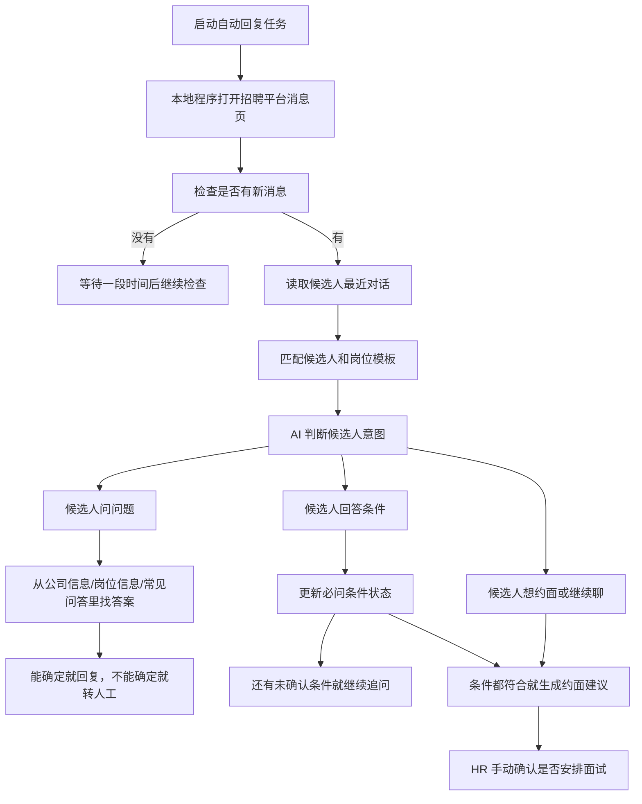

# 自动回复消息工作流方案

本文档用于梳理 GoodHR 5 从“自动打招呼”扩展到“自动回复消息”的整体流程、配置方式和待确认问题。

## 1. 我对人工流程的理解

HR 手动处理候选人大概是这样：

1. 在简历列表先看候选人基础信息。
2. 如果基础信息明显合适，就直接打招呼。
3. 如果不确定，就打开详情页再判断。
4. 打招呼后，候选人可能几分钟、几小时，甚至更久才回复。
5. 候选人回复后，HR 要继续确认硬性条件，比如学历、经验、到岗地点、公积金接受度等。
6. 候选人也会反问公司、岗位、薪资、福利、社保公积金、面试流程等问题。
7. 双方聊到差不多后，AI 可以给“是否建议约面”的判断，但最终必须由 HR 手动确认。

所以自动回复不是简单“收到消息就回一句”，而是一个候选人沟通工作流。

## 2. 第一版建议结论

第一版不要新建一堆独立模块，先复用岗位模板。

建议把“自动回复资料”挂在岗位模板下面，因为候选人问的大部分问题都和当前岗位有关。

岗位模板里新增这些配置：

| 配置块 | 作用 |
| --- | --- |
| 公司信息 | 公司介绍、公司规模、行业、上班时间、福利、社保公积金等 |
| 岗位信息 | 岗位职责、薪资范围、工作地点、出差情况、晋升空间等 |
| 常见问答 | HR 预先写好候选人可能会问的问题和标准回答 |
| 必问条件 | AI 必须确认的硬性条件，比如统招本科、3 年销售经验、能否到指定地区上班 |
| 回复规则 | 哪些能自动发，哪些必须转人工，语气要怎么说 |

公司信息第一版先放在岗位模板里，不单独做公司资料库。

原因很简单：先让流程跑起来。等后面出现“同一家公司很多岗位重复填公司信息”时，再抽成公司资料库。

## 3. 岗位模板应该怎么填

建议岗位模板拆成 4 个区域。

### 3.1 基础筛选

继续保留现在已有的内容：

- 岗位名称
- 关键词
- 排除词
- 岗位描述
- 打招呼语

### 3.2 自动回复资料

给 HR 填这些字段：

| 字段 | 示例 |
| --- | --- |
| 公司简介 | 我们是一家做企业服务的公司，团队 80 人左右 |
| 岗位职责 | 负责企业客户销售、线索跟进、客户维护 |
| 薪资范围 | 8k-15k，具体看经验和面试情况 |
| 工作地点 | 南昌市红谷滩区 |
| 上班时间 | 9:00-18:00，大小周/双休按真实情况填写 |
| 社保公积金 | 社保正常买，公积金暂时不买 |
| 面试流程 | 初面 + 复面，一般 1-3 天内反馈 |
| 不确定内容 | 不确定就留空，AI 不要乱编 |

空字段允许存在。AI 遇到没资料的问题，默认回复：

> 我小声确认一下，这个信息我这边还没拿准，我先帮你转 HR 看看，别让你白等。

### 3.3 常见问答

建议让 HR 直接填“问题 + 回答”。

示例：

| 候选人可能问 | 建议回答 |
| --- | --- |
| 买公积金吗 | 目前暂时不买公积金，社保是正常缴纳的。这个我先说清楚，避免你后面白跑一趟。 |
| 薪资能到多少 | 这个岗位大概是 8k-15k，具体要看经验和面试情况。 |
| 工作地点在哪 | 在南昌红谷滩，通勤距离你可以先评估一下。 |

不要要求 HR 一次填完所有问题。可以先填 5 个最常见问题，后面从真实聊天里补。

### 3.4 必问条件

必问条件建议做成列表。

示例：

| 条件 | 必须确认什么 | 通过标准 | 不通过怎么办 |
| --- | --- | --- | --- |
| 学历 | 是否统招本科 | 候选人明确说是统招本科 | 标记不符合，建议 HR 复核 |
| 经验 | 是否有 3 年以上销售经验 | 候选人明确说有 3 年以上 | 继续追问或标记不符合 |
| 地点 | 是否愿意到南昌上班 | 候选人明确愿意 | 不愿意则标记不符合 |

每个条件需要有 3 个状态：

- 未确认
- 符合
- 不符合

AI 的目标不是一直尬聊，而是把“未确认”的条件一个个问清楚。

## 4. 自动回复主流程



## 5. 在哪里判断有没有新消息

不要放在“每处理一个候选人后都强行检查一次”。

这样会很慢，而且打招呼流程会被频繁打断。

建议第一版这样做：

| 任务模式 | 新消息检查方式 |
| --- | --- |
| 只打招呼 | 不主动回消息，只做当前打招呼流程 |
| 只回消息 | 本地程序进入消息页，每 30-60 秒检查一次新消息 |
| 打招呼 + 回消息 | 回消息优先；每轮打招呼前检查一次消息，每处理一批候选人后再检查一次 |

如果候选人回复了，应该优先处理回复。因为候选人正在聊天时，回复速度比继续打新招呼更重要。

第一版可以用一个本地任务循环，不急着开两个进程。

更稳的做法：

1. 本地程序只允许同一个平台账号同时有一个浏览器操作任务。
2. 任务循环里先检查消息。
3. 有消息就处理消息。
4. 没消息再去打招呼。
5. 每处理一批候选人后，再回来检查消息。

后面如果真有性能需要，再拆成“消息监控进程”和“打招呼进程”，但要加账号锁，避免两个流程同时点同一个浏览器页面。

## 6. 云端和本地怎么分工

继续遵守 GoodHR 5 当前原则：云端是大脑，本地是手脚。

| 模块 | 放哪里 | 原因 |
| --- | --- | --- |
| 岗位模板、问答模板、必问条件 | 云端 | 用户要在网页里配置，也要跟账号走 |
| 招聘平台消息读取 | 本地程序 | 依赖平台登录态、浏览器页面、cookie |
| 点击发送回复 | 本地程序 | 这是浏览器操作 |
| 候选人完整聊天记录 | 第一版建议本地保存 | 涉及隐私，也符合当前架构边界 |
| 条件勾选结果和沟通摘要 | 可同步云端 | 简历库需要展示状态，但不一定要保存全文 |
| AI 生成回复 | 本地程序更合适 | 本地拿到完整消息，再用云端下发的 AI 配置生成 |

待确认问题：

> 你说“现在简历库都在云端”，但现有架构文档写的是云端不保存候选人详情、截图、OCR 和敏感内容。这里需要你确认：以后云端是否允许保存完整聊天记录？还是只保存摘要和状态？

## 7. AI 回复时应该怎么判断

每次有新消息时，AI 需要做 5 件事：

1. 判断候选人是在问问题、回答问题、拒绝、约面，还是闲聊。
2. 如果候选人问问题，就从岗位资料和常见问答里找答案。
3. 如果候选人回答了必问条件，就更新条件状态。
4. 如果还有未确认的必问条件，就继续问下一个最重要的问题。
5. 如果条件都符合，就给 HR 一个约面建议，不能直接替 HR 约面。

AI 回复要有底线：

- 不知道就说不知道，转人工。
- 不承诺没有写在资料里的福利。
- 不为了留住候选人乱说薪资。
- 遇到候选人情绪、投诉、敏感问题，转人工。
- 涉及面试时间最终确认，必须 HR 点确认。

## 8. 条件确认示例

岗位设置了 3 个必问条件：

1. 必须确认是不是统招本科。
2. 必须确认候选人有 3 年以上销售经验。
3. 必须确认候选人愿意到南昌上班。

AI 聊天策略：

1. 先回答候选人正在问的问题。
2. 回答完后，顺手问一个最关键的未确认条件。
3. 不要一次甩 3 个问题，候选人容易跑。

示例回复：

> 这个岗位薪资大概是 8k-15k，具体要看经验和面试情况。我再小声确认一下，你这边是统招本科吗？我怕后面流程卡住，先帮你省点时间。

候选人回复“是统招本科，销售做了 4 年，可以去南昌”后：

| 条件 | 状态 |
| --- | --- |
| 统招本科 | 符合 |
| 3 年以上销售经验 | 符合 |
| 愿意到南昌上班 | 符合 |

然后 AI 给 HR 建议：

> 这个候选人硬性条件都过了，销售经验也匹配。建议约面，但最终还是请 HR 确认一下，别让我一个 AI 擅自安排人生大事。

## 9. 前端需要新增哪些入口

岗位模板页面建议新增 3 个页签：

| 页签 | 内容 |
| --- | --- |
| 打招呼 | 现在已有的筛选和打招呼配置 |
| 自动回复 | 公司信息、岗位信息、常见问答 |
| 必问条件 | 条件列表、通过标准、失败处理 |

任务创建页面建议新增任务模式：

| 模式 | 说明 |
| --- | --- |
| 只打招呼 | 保持现在流程 |
| 只回消息 | 只看消息，不继续打招呼 |
| 打招呼 + 回消息 | 回消息优先，空闲时继续打招呼 |

候选人详情页建议展示：

- 最近沟通摘要
- 必问条件勾选状态
- AI 建议下一步
- “确认安排面试”按钮
- “转人工处理”按钮

## 10. 最小数据设计

第一版尽量少改表。

岗位模板可以先复用已有扩展字段：

```json
{
  "auto_reply": {
    "company_info": {
      "intro": "公司简介",
      "work_time": "上班时间",
      "benefits": "福利",
      "social_security": "社保公积金"
    },
    "job_info": {
      "salary_range": "8k-15k",
      "work_location": "南昌红谷滩",
      "interview_process": "初面 + 复面"
    },
    "faq": [
      {
        "question": "买公积金吗",
        "answer": "目前暂时不买公积金，社保正常缴纳。"
      }
    ],
    "must_ask_conditions": [
      {
        "id": "education",
        "name": "统招本科",
        "pass_rule": "候选人明确表示自己是统招本科",
        "question": "你这边是统招本科吗？"
      }
    ],
    "reply_rules": {
      "auto_send": false,
      "unknown_answer": "transfer_to_hr"
    }
  }
}
```

本地程序保存每个候选人的沟通状态：

```json
{
  "candidate_id": "平台候选人ID",
  "last_message_id": "最后处理过的消息ID",
  "condition_status": {
    "education": "matched",
    "sales_experience": "unknown",
    "work_location": "unmatched"
  },
  "next_action": "ask_sales_experience"
}
```

## 11. 异常和边界情况

| 情况 | 建议处理 |
| --- | --- |
| 候选人问了资料里没有的问题 | 不乱编，转人工 |
| 候选人连续多次不回答条件 | 先回答问题，再轻问一次；超过次数后转人工 |
| 候选人明确不符合硬性条件 | 标记不符合，建议 HR 复核后结束 |
| 候选人辱骂或投诉 | 停止自动回复，转人工 |
| 平台消息页打不开 | 任务暂停，提示用户检查登录状态 |
| AI 生成内容置信度低 | 不自动发送，只生成草稿 |
| 候选人要求约面 | AI 只建议，HR 必须手动确认 |

## 12. 我建议的开发顺序

1. 先做岗位模板里的自动回复资料和必问条件配置。
2. 再做本地程序读取消息列表，识别未读消息。
3. 再做 AI 根据资料生成回复草稿。
4. 再做条件状态勾选。
5. 最后再做自动发送。

第一版可以先默认“生成草稿，HR 确认后发送”。

等确认回复质量稳定，再允许开启“低风险问题自动发送”。

## 13. 需要你确认的问题

1. 云端是否可以保存完整聊天记录？还是只能保存沟通摘要和条件状态？
2. 第一版要不要自动发送？还是先只生成草稿让 HR 点确认？
3. 公司信息是每个岗位单独填，还是你希望做一个全局公司资料，多个岗位共用？
4. 候选人不符合硬性条件时，是自动礼貌结束，还是必须交给 HR 手动处理？
5. 必问条件是否分等级？比如“必须满足”和“加分项”。
6. 第一版优先支持哪个平台的消息回复？Boss、智联，还是猎聘？
7. 候选人要求约面时，AI 是否可以直接发可选时间，还是只能提醒 HR？
8. 如果候选人问薪资上限、五险一金、加班这些敏感问题，是否必须严格按模板回答？
9. 打招呼和回消息同时运行时，你更希望“回消息优先”，还是允许用户自己选择优先级？
10. 简历库里是否要展示每个条件的勾选状态，比如“统招本科：符合 / 经验：待确认 / 地点：不符合”？
