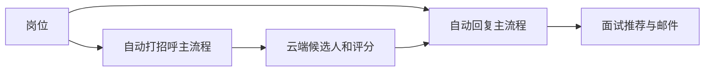
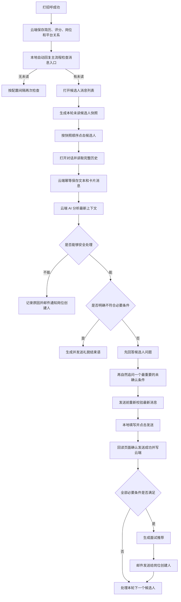

<!-- 本文件用于定义 GoodHR 自动回复功能的产品需求、业务规则、交互流程和验收标准。 -->

# GoodHR 自动回复 PRD

## 1. 文档信息

| 项目 | 内容 |
| --- | --- |
| 文档类型 | PRD（产品需求文档） |
| 功能名称 | 候选人自动回复与面试推荐 |
| 第一平台 | BOSS 直聘 |
| 后续平台 | 智联、猎聘等通过统一协议接入 |
| 核心原则 | 云端是大脑，本地是手脚 |
| 默认发送方式 | AI 生成后直接发送，不经过人工确认 |
| 通知对象 | 岗位创建人 |

## 2. 背景与目标

现有自动打招呼只完成了招聘沟通的第一步。候选人回复后，HR 仍需手动打开消息列表、逐个查看未读、理解历史对话、回答岗位问题、确认必要条件并判断是否值得约面。

自动回复的目标不是简单地“收到一句就回一句”，而是接管从候选人首次回复到形成面试建议之间的完整沟通工作：

1. 打招呼后，把候选人简历、两次 AI 分数、岗位和平台关系保存到云端。
2. 发现 BOSS 消息入口出现未读提示后，打开消息列表。
3. 按稳定顺序逐个处理全部未读候选人。
4. 打开候选人对话，读取并同步完整历史消息。
5. 结合简历、最新对话、岗位知识库和必要条件生成回复。
6. 直接在招聘平台输入框发送。
7. 必要条件全部满足后，生成面向 HR 的面试推荐信息。
8. 每次候选人进入“全部条件满足”状态，都给岗位创建人发送邮件。
9. 邮件链接进入 GoodHR 候选人详情页查看完整依据。

## 3. 范围

### 3.1 第一版包含

- BOSS 直聘消息入口和未读候选人识别。
- 多个未读候选人顺序处理。
- 文本消息和可结构化读取的卡片消息。
- 完整历史消息同步到云端。
- 岗位知识库、必要条件和自定义回复提示词。
- 云端 AI 意图识别、知识检索、条件更新、回复生成和面试总结。
- 自动直接发送回复。
- 不符合必要条件时礼貌结束沟通。
- 无法处理时停止该轮自动发送，并邮件告知岗位创建人。
- 条件全部满足后的面试推荐邮件和详情页。
- 消息、AI 决策、发送结果和通知结果的审计记录。

### 3.2 第一版不包含

- HR 人工接管工作台或客服排队系统。
- 自动安排具体面试时间或替 HR 创建日历日程。
- 自动拨打电话、添加微信或索要平台不允许的信息。
- 图片、语音、附件的内容识别；第一版只记录其类型和页面可见说明。
- 智联、猎聘等其他平台的实际页面操作。
- 因 HR 手动回复而自动暂停单个候选人；HR 需要时自行停止岗位自动回复。

## 4. 用户与核心对象

### 4.1 用户角色

- 岗位创建人：配置岗位、知识库、必要条件和回复提示词；接收面试推荐与异常邮件。
- 候选人：在招聘平台与 HR 账号沟通，不需要登录 GoodHR。
- GoodHR 本地程序：操作招聘平台页面。
- GoodHR 云端：保存业务数据并完成 AI 决策。

### 4.2 关键业务对象

- 候选人主体：同一平台候选人的统一简历档案。
- 岗位触达：某候选人在某岗位、某平台账号下的一段沟通过程。
- 对话线程：完整历史消息、同步游标和处理状态。
- 必要条件：必须通过聊天确认的招聘条件。
- 条件证据：简历或某条消息对条件的支持、否定或冲突信息。
- AI 决策：一次收到新消息后产生的意图、条件变化、回复和动作。
- 面试推荐：条件全部满足时生成的 HR 阅读版总结。

## 5. 产品结构

自动回复与现有“岗位运行/自动打招呼”是同级主流程：

```mermaid
flowchart LR
  Position["岗位"] --> Greet["自动打招呼主流程"]
  Position --> Reply["自动回复主流程"]
  Greet --> CloudCandidate["云端候选人和评分"]
  CloudCandidate --> Reply
  Reply --> Interview["面试推荐与邮件"]
```

两个主流程可以共享岗位、账号、候选人和日志，但不能把自动回复的状态机、循环和异常处理继续塞进自动打招呼主流程。

## 6. 端到端主流程

```mermaid
flowchart TD
  A["打招呼成功"] --> B["云端保存简历、评分、岗位和平台关系"]
  B --> C["本地自动回复主流程检查消息入口"]
  C -->|无未读| D["按配置间隔再次检查"]
  C -->|有未读| E["打开候选人消息列表"]
  E --> F["生成本轮未读候选人快照"]
  F --> G["按快照顺序点击候选人"]
  G --> H["打开对话并读取完整历史"]
  H --> I["云端幂等保存文本和卡片消息"]
  I --> J["云端 AI 分析最新上下文"]
  J --> K{"是否能够安全处理"}
  K -->|不能| L["记录原因并邮件通知岗位创建人"]
  K -->|能| M{"是否明确不符合必要条件"}
  M -->|是| N["生成并发送礼貌结束语"]
  M -->|否| O["先回答候选人问题"]
  O --> P["再自然追问一个最重要的未确认条件"]
  P --> Q["发送前重新校验最新消息"]
  Q --> R["本地填写并点击发送"]
  R --> S["回读页面确认发送成功并写云端"]
  S --> T{"全部必要条件是否满足"}
  T -->|否| U["处理本轮下一个候选人"]
  T -->|是| V["生成面试推荐"]
  V --> W["邮件发送给岗位创建人"]
  W --> U
```

## 7. BOSS 未读消息处理规则

### 7.1 发现未读

1. 本地程序进入或保持在 BOSS 消息页面。
2. 读取页面消息入口的未读图标或未读数量。
3. 点击入口后，等候选人会话列表稳定显示。
4. 提取本轮所有未读候选人，形成快照，避免列表刷新造成跳项或重复。

### 7.2 处理顺序

第一版按页面从上到下处理；若页面能稳定读取最后消息时间，则按最后消息时间从早到晚处理，让等待最久的人先得到回复。

每处理完一人后不依赖旧下标直接点击下一人，而是重新读取列表，通过平台候选人标识、姓名与最近消息组合定位快照中的下一项。

### 7.3 打开对话

打开候选人后可能出现独立对话区域或弹框。必须等待候选人姓名、聊天内容和输入框同时可用，防止读取到上一位候选人的残留内容。

### 7.4 历史消息

- 首次处理：向上加载到能读取的最早历史消息，再完整同步。
- 后续处理：仍读取当前可见历史并与云端去重，保证人工发送和页面变化能被补录。
- 不依赖“未读数量”等于新增消息条数。
- 同一条消息重复抓取不得重复入库、重复触发 AI 或重复发送。

## 8. 消息类型

| 类型 | 第一版处理 |
| --- | --- |
| 文本 | 保存正文，参与 AI 理解与回复 |
| 岗位卡片 | 保存卡片类型、标题、岗位和页面可见字段，参与上下文 |
| 简历卡片 | 保存卡片类型和页面可见摘要，关联候选人简历 |
| 面试/交换联系方式等动作卡片 | 保存动作类型和状态，禁止 AI 假装已完成动作 |
| 图片、语音、文件 | 保存占位消息和页面可见说明；不猜内容，不自动回复该未知内容 |
| 表情 | 能识别文字含义则保存；否则作为非文本消息保存 |
| 系统通知 | 保存但默认不作为候选人表达参与条件判断 |

如果最新候选人消息只有第一版不支持理解的内容，系统不发送猜测性回复，记录“消息类型暂不支持”，并给岗位创建人发异常邮件。

## 9. 岗位自动回复配置

### 9.1 配置结构

| 配置区 | 内容 |
| --- | --- |
| 开关与频率 | 是否开启、轮询间隔、单轮最大候选人数 |
| 企业知识 | 公司简介、规模、行业、文化、办公时间、福利、社保公积金 |
| 岗位知识 | 职责、团队、地点、薪资、提成、出差、工作时间、面试流程 |
| 常见问答 | 问题、标准答案、适用范围、是否允许直接发送 |
| 必要条件 | 条件名称、询问方式、通过规则、不通过结束语、优先级 |
| 回复风格 | 用户可编辑的回复提示词、称呼、语气、长度和禁用表达 |
| 结束沟通 | 通用结束语和按条件定制的结束语 |

### 9.2 四层提示词

从高到低合并：

1. 系统安全规则：不可编辑，禁止编造、违法歧视、虚假承诺、泄露隐私和越权操作。
2. 企业规则：公司统一口径和不能对外透露的信息。
3. 岗位规则：当前岗位事实、问答、必要条件和结束策略。
4. 用户回复提示词：用户可编辑语气、表达习惯、称呼和沟通节奏。

低层提示词不能覆盖高层规则。例如用户写“没有资料也要给肯定答复”，系统必须忽略。

## 10. 候选人可能提出的问题

知识库和 AI 意图至少要覆盖：

| 分类 | 常见问题 |
| --- | --- |
| 薪资 | 薪资范围、底薪、提成、奖金、年终奖、发薪日、试用期薪资 |
| 工作地点 | 具体地址、地铁、通勤、异地、远程、是否提供住宿 |
| 工作时间 | 上下班、单双休、排班、加班、调休、出差频率 |
| 福利保障 | 五险一金、餐补、房补、节日福利、体检、带薪假 |
| 岗位内容 | 具体职责、产品、客户来源、业绩目标、汇报对象、团队规模 |
| 任职要求 | 学历、专业、经验、证书、年龄、语言、驾驶证 |
| 公司情况 | 行业、规模、业务、融资、办公环境、稳定性 |
| 招聘流程 | 面试轮数、线上或线下、面试人、反馈周期、入职材料 |
| 发展空间 | 晋升、培训、转岗、管理路径、试用期考核 |
| 隐私与真实性 | 为什么联系我、从哪里看到简历、岗位是否真实 |
| 沟通动作 | 想看 JD、发定位、加微信、打电话、约时间 |
| 拒绝与犹豫 | 暂不考虑、薪资低、距离远、正在职、晚点联系 |

没有可靠资料时不得编造。系统可以用岗位创建人配置的兜底话术说明“这个信息我还没拿准”，同时发送异常邮件；是否继续追问其他条件由 AI 根据语境判断。

## 11. HR 可能需要确认的问题

必要条件不是固定字段，岗位创建人可以自定义。常见类别包括：

- 是否接受异地工作、通勤距离、出差或驻场。
- 最早到岗时间、离职周期和当前是否在职。
- 期望薪资、最低接受薪资和薪资结构接受度。
- 学历性质、专业、证书和语言能力。
- 相关行业、岗位、管理或销售经验年限。
- 是否做过指定产品、客户类型或业务模式。
- 是否接受排班、单双休、夜班、加班或特殊工时。
- 是否拥有驾照、车辆、作品集或特定设备。
- 是否接受劳动关系、试用期、社保公积金等真实条件。
- 是否有明确面试意愿以及可沟通时间段。

一个必要条件至少包含：名称、业务说明、优先级、推荐问法、通过规则、不通过规则、不通过结束语。

## 12. 条件判断规则

### 12.1 状态

- `unknown`：尚未获得足够信息。
- `matched`：最新有效证据明确符合。
- `unmatched`：最新有效证据明确不符合。
- `conflicted`：简历、历史消息或当前回复存在冲突，需要以最新明确回复继续确认。

### 12.2 证据优先级

1. 候选人最新、明确、直接针对该条件的回复。
2. 候选人较早的明确回复。
3. 简历中的结构化字段和原文。
4. AI 推断只能用于决定怎么问，不能单独把必要条件判为通过。

简历可以提供线索，但“接受异地、到岗时间、薪资接受度”等必须通过聊天获得明确答复。新回复与简历冲突时，以最新明确回复更新状态，并保留冲突证据给 HR 查看。

### 12.3 询问策略

- 先回答候选人当前问题，再追问条件。
- 一次最多自然追问一个主要条件。
- 优先问会直接决定是否继续沟通的条件。
- 已明确回答的内容不重复问。
- 候选人一次回答多个条件时，要一次性更新多个状态。
- 候选人回避同一问题时，最多按配置重问；超过次数后记录无法确认并邮件通知岗位创建人。

### 12.4 不符合时

任何必要条件被最新明确回复判定为不符合时：

1. 不继续盘问其他条件。
2. 使用该条件专属结束语；未配置时使用岗位通用结束语。
3. 语气礼貌，不评价候选人，不暴露内部评分。
4. 发送结束语后把线程标记为 `ended_unmatched`。
5. 保存不符合条件、证据消息和实际发送文本。

示例：

> 明白了，感谢你认真回复。这个岗位目前确实需要长期在南昌办公，和你现在的安排不太合适，我就不继续占你时间了。后面有更合适的机会再联系你。

## 13. AI 单轮决策

每次处理新增候选人消息，云端按顺序完成：

1. 合并候选人简历、评分、岗位知识、完整对话和当前条件状态。
2. 区分候选人消息、HR/AI 已发消息、卡片和系统通知。
3. 提取候选人意图，可同时存在“提问 + 回答条件 + 表达意愿”。
4. 更新所有被本轮消息影响的条件和证据。
5. 判断是否命中礼貌结束、无法处理或正常继续。
6. 从知识库检索候选人问题的可靠答案。
7. 选择一个最重要的未确认条件。
8. 生成一条自然、简短、可直接发送的回复。
9. 结构化返回决策、条件变化、回复、依据和禁止发送原因。

## 14. 自动发送规则

第一版默认直接发送，不提供发送前人工审核。

发送前必须再做一次保护校验：

- 对话仍是同一候选人。
- 云端决策对应的最后一条候选人消息仍是页面最新消息。
- 输入框可用且没有残留文本。
- 没有出现新的候选人消息或 HR 手动消息。
- 本决策尚未成功发送过。

如果发送前出现新消息，丢弃旧回复，重新同步并让云端重新决策。HR 手动发送的消息会同步进历史，但不会自动暂停线程。

发送后必须从页面回读最后一条己方消息，确认文本或可用指纹匹配；只点击按钮但未回读成功，不能记为发送成功。

## 15. 无法处理与通知

第一版不建设“转人工”功能。统一称为“无法自动处理”：

### 15.1 触发情况

- 最新消息只有不支持理解的图片、语音或附件。
- 候选人问题缺少可靠知识，AI 无法安全回答。
- 候选人持续回避必要条件，达到重问上限。
- AI 输出不符合结构、为空或安全校验失败。
- 对话身份不确定、候选人无法与云端档案可靠关联。
- 页面发送失败且重试后仍无法确认。

### 15.2 处理动作

1. 不向候选人发送猜测内容。
2. 记录候选人、岗位、原消息、失败原因和页面状态。
3. 将线程标记为 `blocked`，避免每轮重复尝试同一条消息。
4. 给岗位创建人发异常邮件。
5. 新候选人消息到达后允许重新进入 AI 判断，不永久封死会话。

异常邮件需要明确：候选人姓名、平台、岗位、最新消息摘要、无法处理原因、发生时间和 GoodHR 详情链接。

## 16. 全部条件满足与面试推荐

### 16.1 达成条件

只有全部必要条件均为 `matched`，且每个需要聊天确认的条件都有明确消息证据，才进入 `qualified`。

### 16.2 推荐内容

面试推荐至少包含：

- 候选人基础信息和来源平台。
- 当前岗位与两次 AI 评分、评分理由。
- 核心经历与岗位匹配点。
- 每个必要条件的结果、证据和最新回答。
- 候选人关注的问题和 GoodHR 已给出的答案。
- 薪资、地点、到岗、工作时间等关键意向。
- 简历与聊天中的冲突或风险点。
- 对话摘要和重要原话定位。
- 建议 HR 面试重点追问的问题。
- 结论：建议进入面试沟通，但不自动安排面试。

### 16.3 邮件规则

- 收件人固定为岗位创建人的账号邮箱。
- 候选人每次从非 `qualified` 状态进入 `qualified` 都发送一次。
- 同一组条件、同一版本的重复轮询不得重复发送。
- 如果最新回复让候选人从符合变为不符合，状态随之更新。
- 后续又获得新证据并再次全部满足，则形成新版本并再次发送邮件。
- 邮件中的链接进入 GoodHR；未登录先登录，登录后回到候选人详情。

## 17. 页面需求

### 17.1 岗位配置页

新增“自动回复”区域：

- 开启/停止自动回复。
- 企业与岗位知识库。
- 常见问答。
- 必要条件编辑和排序。
- 用户自定义回复提示词。
- 礼貌结束语。
- 检查间隔与重问上限。

### 17.2 岗位运行页

自动打招呼与自动回复展示为两个同级状态：

- 自动回复运行状态、最近检查时间。
- 未读候选人数、今日已回复、回复失败和符合人数。
- 最近异常及“查看候选人”。
- 启动、停止、重试。

### 17.3 候选人详情页

- 简历和两次 AI 分数。
- 完整时间线：候选人消息、己方消息、卡片和系统事件。
- 必要条件状态与逐条证据。
- 当前自动回复状态和下一步。
- AI 决策依据、实际发送内容和失败原因。
- 历次面试推荐和邮件发送记录。

## 18. 状态定义

| 状态 | 说明 |
| --- | --- |
| `waiting` | 没有待处理的新消息 |
| `syncing` | 正在读取和同步历史消息 |
| `deciding` | 云端 AI 正在生成决策 |
| `sending` | 本地正在发送并回读确认 |
| `waiting_candidate` | 已发送，等待候选人回复 |
| `qualified` | 全部必要条件满足 |
| `ended_unmatched` | 明确不符合并已礼貌结束 |
| `blocked` | 当前消息无法自动处理，已通知岗位创建人 |
| `stopped` | 岗位创建人停止了自动回复 |

## 19. 异常与边界

| 场景 | 处理 |
| --- | --- |
| 消息列表刷新后顺序变化 | 使用本轮快照和候选人标识，不使用旧下标盲点 |
| 同名候选人 | 结合平台 ID、对话链接、岗位和最近消息指纹关联 |
| 页面只有未读红点没有数量 | 打开列表后逐行识别未读状态 |
| 历史消息很多 | 分页向上加载，设置安全上限并记录是否完整 |
| 消息没有平台 ID | 生成稳定指纹，并保存原始可见字段用于去重 |
| HR 与 AI 同时准备发送 | 发送前重新同步；发现新己方消息则废弃旧决策 |
| BOSS 登录失效 | 停止账号流程，提示重新登录，不继续点击页面 |
| BOSS 页面改版 | 连续定位失败触发熔断，避免误点，通知岗位创建人 |
| 云端超时 | 不发送旧回复；指数退避重试并保持消息待处理 |
| 邮件发送失败 | 推荐结果仍保存，邮件任务重试并记录失败 |
| 候选人删除或屏蔽 | 结束线程并记录平台状态 |
| AI 余额不足 | 不调用、不发送，通知岗位创建人补充 AI 余额 |

## 20. 日志与审计

每轮至少记录：

- 检查时间、账号、页面和未读数量。
- 候选人定位依据和历史同步范围。
- 新增消息数量、类型和去重结果。
- 使用的知识库版本、提示词版本和模型。
- AI 结构化决策、条件变化和证据消息。
- 计划回复、实际发送文本、发送确认和失败原因。
- 面试推荐版本、邮件收件人和发送状态。

日志页面默认隐藏手机号、邮箱等敏感信息；详情权限按租户和岗位归属校验。

## 21. 指标

- 新消息发现到回复成功的中位耗时。
- 自动回复成功率和页面回读确认率。
- 重复发送次数，目标为 0。
- 无法处理率及原因分布。
- 必要条件平均确认轮次。
- 礼貌结束人数、全部符合人数和推荐邮件成功率。
- AI 单轮 Token、费用和失败率。

## 22. 验收标准

1. BOSS 同时出现多个未读候选人时，系统能逐个处理且不漏不重。
2. 首次打开候选人能同步可读取的完整历史，文本和卡片均有结构化记录。
3. 云端能用简历、评分、知识库、历史消息和最新回复生成结构化决策。
4. 候选人一条消息回答多个条件时，各条件能同时更新。
5. 最新明确回复与简历冲突时，以最新回复为准并保留冲突记录。
6. 正常决策会直接发送，发送前后均有防重复校验。
7. 任一必要条件不满足时发送礼貌结束语，不继续追问。
8. 仅图片/语音等无法理解时不乱回，并邮件通知岗位创建人。
9. 全部条件满足时生成完整面试推荐并发送给岗位创建人。
10. 同一资格版本重复轮询不重复发邮件；离开后再次进入符合状态会再次发邮件。
11. HR 手动回复不会自动暂停，但 AI 发送前能识别新消息并重新决策。
12. 自动回复流程可以独立启动和停止，不破坏自动打招呼主流程。

## 23. 分期建议

### 阶段一：数据与配置

云端消息表、条件表、回复配置、提示词版本、候选人详情和 API。

### 阶段二：BOSS 读取闭环

未读识别、顺序处理、历史加载、文本/卡片解析、幂等同步。

### 阶段三：云端 AI 与发送闭环

结构化 AI 决策、知识检索、条件更新、直接发送、回读确认和失败通知。

### 阶段四：面试推荐

条件达成事件、综合总结、岗位创建人邮件、详情深链。

### 阶段五：稳定性与扩平台

真实环境回归、选择器熔断、指标告警，再按统一平台协议接入智联和猎聘。
